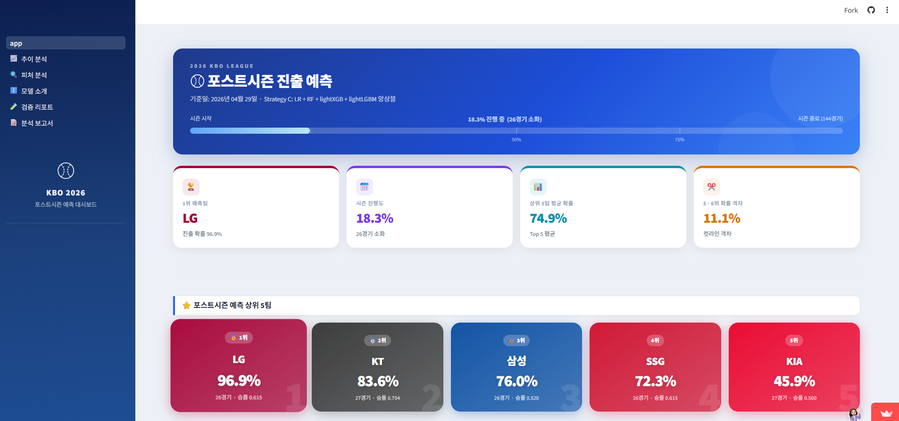
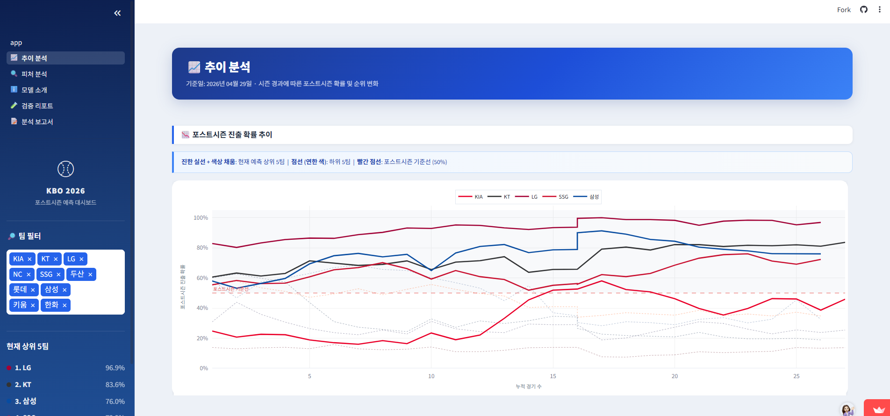
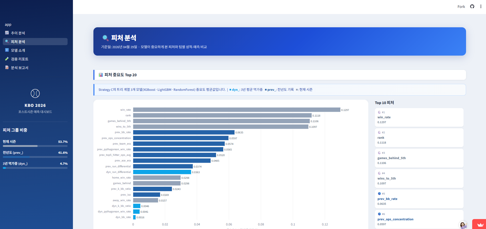
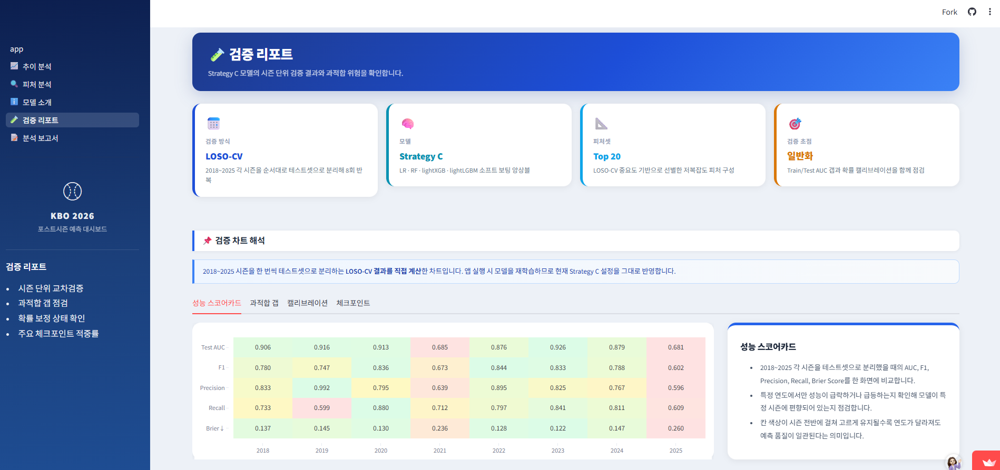
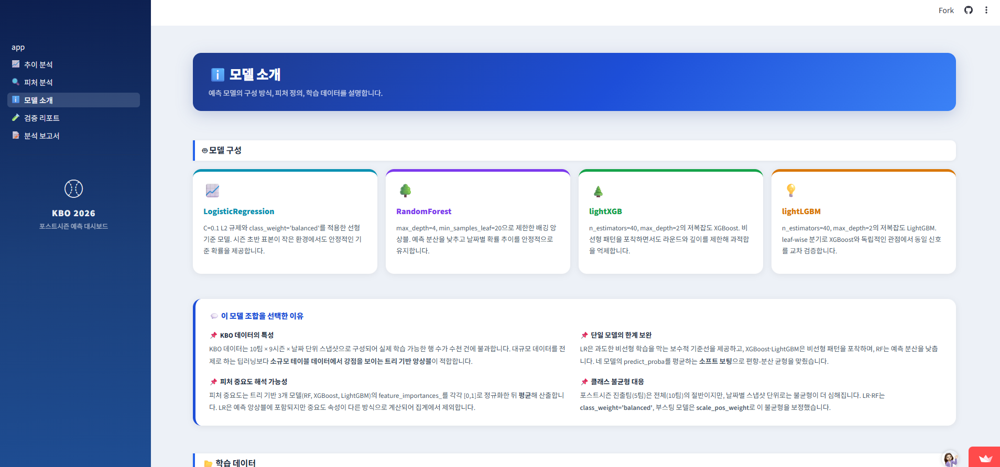
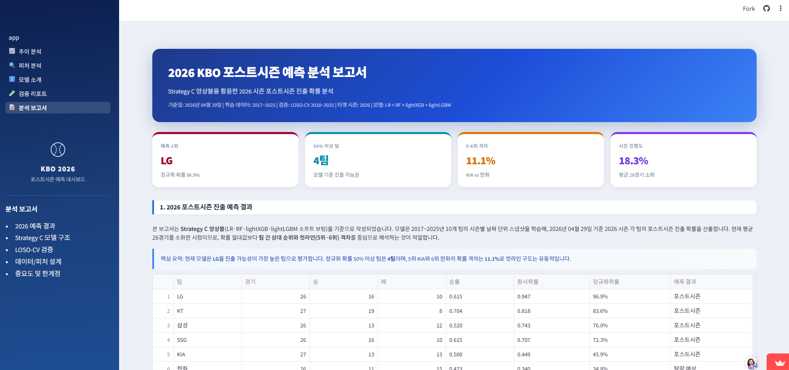

# ⚾ VCT3 - ML Baseball

## KBO 2026 포스트시즌 진출 확률 예측 대시보드

> KBO 정규시즌 데이터를 기반으로 팀별 포스트시즌 진출 가능성을 예측하고, Streamlit 대시보드에서 확률 추이와 주요 피처를 시각화하는 머신러닝 프로젝트입니다.

---

## 1. 프로젝트 개요

| 항목 | 내용 |
|---|---|
| 프로젝트명 | KBO 2026 포스트시즌 진출 예측 대시보드 |
| 진행 기간 | 2026.04.24 ~ 2026.04.29 |
| 인원 | 4인 팀 프로젝트 |
| 담당 역할 | 피처 엔지니어링, 모델 학습/검증, Streamlit 대시보드, 코드 아키텍처 설계 |
| 핵심 성과 | LOSO-CV 평균 Test AUC **0.848** 달성, 10단계 실험 이터레이션을 통한 과적합 갭 개선 |

KBO는 10개 구단 중 5개 팀이 포스트시즌에 진출하기 때문에, 시즌 초반 순위만으로 최종 5강을 판단하기 어렵습니다. 특히 개막 직후에는 현재 시즌 데이터가 충분히 쌓이지 않아, 전년도 성적과 최근 몇 년간의 전력 지표를 함께 고려해야 합니다.

본 프로젝트는 2016~2026년 KBO 팀/선수 기록을 수집하고, 현재 시즌 흐름과 과거 전력 지표를 결합하여 2026 시즌 각 팀의 포스트시즌 진출 확률을 예측합니다. 단순히 진출 여부를 분류하는 것이 아니라, 팀별 확률과 주요 근거를 대시보드에서 확인할 수 있도록 구성했습니다.

---

## 2. 프로젝트 필요성

- **초반 순위의 불안정성**  
  4월 순위만으로 최종 포스트시즌 진출 팀을 판단하기에는 변동성이 큽니다.

- **현재 시즌 데이터 부족 문제**  
  시즌 초반에는 팀당 경기 수가 적어 현재 성적만으로는 예측 신뢰도가 낮습니다.

- **과거 전력 반영 필요성**  
  전년도 성적과 최근 3년 평균 전력 지표를 함께 활용하면 시즌 초반 예측력을 보완할 수 있습니다.

- **해석 가능한 예측 결과 필요**  
  단순히 “진출/미진출”이 아니라 어떤 지표가 확률에 영향을 주었는지 설명할 수 있어야 합니다.

---

## 3. 프로젝트 목표

- 2026 KBO 시즌 각 팀의 포스트시즌 진출 확률 예측
- 시즌 진행도에 따라 현재 성적과 과거 전력의 반영 비중 조절
- 팀별 확률, 순위 변화, 피처 중요도, 검증 결과를 Streamlit 대시보드로 시각화
- raw CSV 수집부터 전처리, 피처 생성, 모델 학습, 예측까지 재현 가능한 파이프라인 구축

---

## 4. 데이터 파이프라인

```text
data/raw/{year}/              # KBO 공식 사이트 기반 원본 데이터
        ↓
data/processed/{year}/        # 전처리 및 피처 생성
        ↓
data/modeling/
├── train_dataset.csv          # 2017~2025 학습 데이터
└── predict_dataset_2026.csv   # 2026 예측 데이터
        ↓
ML Model
        ↓
Streamlit Dashboard
```

### 수집 데이터

| 구분 | 파일 예시 | 활용 목적 |
|---|---|---|
| 팀 일자별 순위 | `team_daily_rank.csv` | 날짜별 순위, 승률, 게임차, 최근 흐름 피처 생성 |
| 팀 최종 순위 | `team_final_rank.csv` | 포스트시즌 진출 여부 라벨 생성 |
| 팀 타격/투수/수비/주루 기록 | `team_hitter_basic.csv` 등 | OPS, ERA, WHIP, K/BB 등 팀 전력 피처 생성 |
| 선수 타자/투수 기록 | `player_hitter_basic.csv` 등 | 상위 타자 OPS, 에이스 ERA 등 선수 기반 전력 피처 생성 |

---

## 5. 피처 설계

최종 피처는 현재 시즌 지표, 전년도 지표, 최근 3년 평균 기반 동적 감쇠 피처를 결합해 구성했습니다.

| 구분 | 설명 | 주요 변수 |
|---|---|---|
| 현재 시즌 피처 | 현재 순위, 승률, 5위 기준 격차, 홈/원정 승률 등 | `rank`, `win_rate`, `games_behind_5th`, `wins_to_5th` |
| 전년도 피처 | 직전 시즌 팀 전력 지표 | `prev_pythagorean_win_rate`, `prev_team_era`, `prev_top5_hitter_ops_avg` |
| 동적 감쇠 피처 | 최근 3년 평균 전력을 시즌 진행도에 따라 감쇠 | `dyn_run_differential`, `dyn_pythagorean_win_rate`, `dyn_bb_rate` |

### 핵심 피처: `dyn_`

```python
dyn_X = (1 - games_played_ratio) * avg3yr_X
```

`dyn_` 피처는 시즌 초반에는 최근 3년 평균 전력을 크게 반영하고, 시즌이 진행될수록 과거 전력의 영향이 줄어들도록 설계한 변수입니다.

- 시즌 초반: `games_played_ratio ≈ 0` → 과거 3년 평균 전력 반영 비중 높음
- 시즌 후반: `games_played_ratio ≈ 1` → 과거 전력 영향 감소, 현재 시즌 성적 중심

이를 통해 시즌 초반 데이터 부족 문제를 완화하고, 후반에는 현재 시즌 성적이 예측을 주도하도록 구성했습니다.

---

## 6. 담당 역할

### 6.1 피처 엔지니어링

크롤링된 원본 데이터에서 122개 컬럼을 구성한 뒤, 모델 후보 36개 피처를 만들고 최종 Top 20 피처로 축소했습니다.

**일자별 파생 변수 구현**

- `win_rate_delta_30d`: 30일 전 대비 승률 변화량
- `recent20_win_rate`, `recent30_win_rate`: 최근 20경기/30경기 승률
- `games_behind_5th`: 날짜별 5위 팀 기준 게임차
- `wins_to_5th`: 5위 추월에 필요한 승수

**다년도 집계 변수 구현**

- 전년도 기록을 `season + 1`로 시프트하여 `prev_` 피처 생성
- t-1, t-2, t-3 시즌 데이터를 기반으로 `avg3yr_`, `trend_` 피처 생성
- 시즌 진행률 기반 `dyn_` 피처 설계 및 적용

**최종 피처 선정**

- XGBoost, LightGBM, RandomForest의 `feature_importances_`를 정규화
- 모델별 중요도를 평균 내어 Top 20 피처 선정
- 현재 시즌 7개, 전년도 9개, 동적 감쇠 4개 피처로 최종 구성

---

### 6.2 모델 학습 및 검증

단일 모델에서 시작해 10단계 실험을 거치며 성능과 일반화 가능성을 개선했습니다.

```text
01_randomforest_experiment     → RandomForest 단독 베이스라인
02_slim_features_experiment    → 피처 수 축소 실험
03_validate_2025               → 2025 시즌 단일 검증
04_preseason_predict           → 시즌 초반 예측 테스트
05_multiyear_compare           → 다년도 비교 검증
06_validate_2024               → 2024 시즌 추가 검증
07_fix_3yr_compare             → 3년 평균 피처 보정
08_ensemble_model_eval         → XGB + LGBM + RF 앙상블 도입
09_feature_reduced_eval        → 중요도 기반 피처 리덕션
10_low_overfit_eval            → 과적합 억제를 위한 모델 복잡도 제한
```

최종 모델은 Logistic Regression, RandomForest, XGBoost, LightGBM을 균등 평균하는 소프트보팅 앙상블 구조로 구성했습니다.

```python
@dataclass
class StrategyCModel:
    lr: Pipeline
    rf: RandomForestClassifier
    xgb: XGBClassifier
    lgbm: LGBMClassifier

    def predict_proba(self, X):
        # 4개 모델의 예측 확률을 균등 평균
        ...

    def feature_importance(self):
        # 트리 기반 모델의 중요도를 정규화 후 평균
        ...
```

### 주요 함수

| 함수 | 역할 |
|---|---|
| `fit_strategy_c()` | 4개 모델 학습 및 시즌 가중치 적용 |
| `run_loso_cv()` | 2017~2025 Leave-One-Season-Out 교차검증 수행 |
| `predict_2026()` | 전체 데이터로 최종 학습 후 2026 시즌 예측 |
| `load_model_and_predict()` | Streamlit 앱에서 모델 학습, 예측, 피처 중요도 반환 |

---

### 6.3 Streamlit 대시보드 구현

Streamlit 기반으로 예측 결과를 확인할 수 있는 5개 페이지의 대시보드를 구현했습니다.

| 페이지 | 주요 기능 |
|---|---|
| 홈 | 시즌 진행도, Top 5 카드, 전체 순위 테이블 |
| 추이 분석 | 날짜별 포스트시즌 진출 확률 변화, 순위 추이 |
| 피처 분석 | 피처 중요도, 팀별 지표 비교, 히트맵 |
| 모델 소개 | 앙상블 구조, `dyn_` 변수, 주요 피처 설명 |
| 검증 리포트 | LOSO-CV 성능표, 과적합 갭, 캘리브레이션 곡선 |

대시보드는 `load_model_and_predict()`와 `run_loso_cv_for_app()`을 통해 모델 모듈과 직접 연결되며, 앱 실행 시 데이터 로드부터 예측 및 검증 결과 확인까지 가능하도록 구성했습니다.

---

## 7. 모델 성능

### LOSO-CV 검증 결과

| 지표 | 수치 |
|---|---:|
| 평균 Test AUC | 0.848 |
| 평균 Accuracy | 0.762 |
| 평균 F1 Score | 0.762 |
| 평균 Brier Score | 0.163 |

LOSO-CV는 2017~2025 시즌을 한 시즌씩 검증 데이터로 분리하여, 특정 시즌에만 과적합되지 않는지 확인하기 위해 사용했습니다.

---

## 8. 2026 예측 결과

> 기준일: 2026.04.29

| 순위 | 팀 | 정규화 확률 |
|---:|---|---:|
| 1 | LG | 96.9% |
| 2 | KT | 83.6% |
| 3 | 삼성 | 76.0% |
| 4 | SSG | 72.3% |
| 5 | KIA | 45.9% |
| 6 | 한화 | 34.8% |
| 7 | NC | 32.6% |
| 8 | 두산 | 25.4% |
| 9 | 롯데 | 18.9% |
| 10 | 키움 | 13.7% |

---

## 9. 주요 화면

| 홈 대시보드 | 추이 분석 |
|:---:|:---:|
|  |  |

| 피처 분석 | 검증 리포트 |
|:---:|:---:|
|  |  |

| 모델 소개 | 분석 보고서 |
|:---:|:---:|
|  |  |

---

## 10. 기술 스택

| 분류 | 기술 |
|---|---|
| Language | Python 3.12 |
| Data Processing | Pandas, NumPy |
| Machine Learning | scikit-learn, XGBoost, LightGBM, SHAP |
| Visualization | Streamlit, Plotly, Matplotlib |
| Package Management | uv |
| Collaboration | Git, GitHub |

---

## 11. 프로젝트 구조

```text
src/
├── preprocessing/
│   ├── build_preprocessed.py      # raw → processed 전체 오케스트레이션
│   ├── make_features.py           # prev_, avg3yr_, dyn_, daily 피처 생성
│   ├── clean_team_rank.py         # 팀 순위 데이터 전처리
│   ├── clean_team_stats.py        # 팀 기록 전처리 및 병합
│   └── clean_player_stats.py      # 선수 기록 전처리 및 요약 통계
├── dataset/
│   ├── build_train_dataset.py     # 학습 데이터 조립 및 dyn_ 계산
│   └── build_predict_dataset.py   # 2026 예측 데이터 조립
├── evaluation/
│   └── metrics.py                 # AUC, F1, Brier, 체크포인트 평가 함수
├── utils/
│   ├── config.py                  # FEATURE_COLS, TOP_FEATURES, 시즌 범위 설정
│   └── paths.py                   # 경로 상수 관리
└── app/
    ├── app.py                     # Streamlit 메인 대시보드
    ├── pages/                     # 5개 서브 페이지
    └── components/                # 차트, 스타일, 모델 래퍼
```

---

## 12. 실행 방법

### 1) 패키지 설치

```bash
uv sync
```

### 2) Streamlit 앱 실행

```bash
streamlit run src/app/app.py
```

---

## 13. 트러블 슈팅

### 13.1 시즌 초반 데이터 부족

**문제**  
2026 시즌 4월 기준으로 팀당 경기 수가 적어 현재 시즌 데이터만으로는 예측 표본이 부족했습니다.

**해결**  
전년도 지표와 최근 3년 평균 지표를 함께 활용하고, `dyn_` 피처를 설계하여 시즌 초반에는 과거 전력을 크게 반영하고 후반에는 현재 성적 중심으로 전환되도록 했습니다.

---

### 13.2 과적합 문제

**문제**  
앙상블 실험 초기에는 Train AUC와 Test AUC 간 차이가 커 과적합 가능성이 있었습니다.

**해결**

- 피처를 36개에서 중요도 기반 Top 20으로 축소
- XGBoost, LightGBM의 `max_depth`, `n_estimators`를 제한
- 정규화 파라미터를 강화하여 모델 복잡도 조절

**결과**  
Train-Test AUC 갭을 줄이면서도 Test AUC 0.848을 유지했습니다.

---

### 13.3 최종 모델 선정 기준

여러 실험 모델 중 최종 모델은 단순 성능만이 아니라 다음 기준을 함께 고려해 선정했습니다.

1. 시즌 초반 예측력
2. LOSO-CV 기반 일반화 성능
3. `dyn_` 핵심 피처 반영 여부
4. Streamlit 앱과의 연결 가능성
5. 피처 중요도 기반 해석 가능성

---

## 14. 회고

이번 프로젝트에서는 시즌 초반 데이터 부족이라는 제약을 해결하기 위해 현재 시즌 성적과 과거 전력 지표를 함께 사용하는 방향으로 모델을 설계했습니다. 특히 `dyn_` 피처를 통해 시즌 진행도에 따라 과거 전력의 영향이 자연스럽게 줄어들도록 만든 점이 가장 핵심적인 시도였습니다.

또한 단일 모델 성능만 확인하는 데서 끝나지 않고, 10단계 실험 이터레이션을 통해 RandomForest 단독 모델에서 앙상블 모델, 피처 리덕션, 과적합 억제까지 단계적으로 개선했습니다. LOSO-CV를 적용하면서 특정 시즌에만 잘 맞는 모델이 아니라 여러 시즌에 대해 일반화 가능한 모델인지 검증할 수 있었습니다.

마지막으로 모델 실험 코드를 `StrategyCModel` 중심으로 리팩토링하고 Streamlit 대시보드와 연결하면서, 예측 모델을 실제 사용자가 확인할 수 있는 서비스 형태로 확장했습니다.

---

## 15. 고도화 방향

### Phase 1. 시계열 예측 모델 도입

현재 모델은 각 날짜의 팀 상태를 독립적인 행으로 학습합니다. 향후에는 LSTM 또는 Temporal Fusion Transformer(TFT)를 활용하여 최근 N경기 흐름, 연승/연패 모멘텀, 홈/원정 패턴 등 순서 정보를 반영할 수 있습니다.

### Phase 2. 비정형 데이터 피처 추가

뉴스 기사, KBO 공식 공지, 팬 커뮤니티 텍스트에서 부상, 외국인 선수 교체, 트레이드, 팀 분위기 등의 이벤트를 추출하여 정형 데이터와 결합할 수 있습니다.

```text
뉴스 기사 / 커뮤니티 텍스트
        ↓
LLM 기반 이벤트 추출
        ↓
{ team, event_type, impact_score, sentiment }
        ↓
기존 피처와 병합 후 모델 입력
```

### Phase 3. 자연어 분석 리포트 자동 생성

예측 확률, 피처 중요도, SHAP 값, 최근 경기 결과를 LLM에 전달하여 팀별 맞춤 분석 리포트를 자동 생성할 수 있습니다. 이를 통해 수치 기반 예측 결과를 팬이 이해하기 쉬운 자연어 인사이트로 확장할 수 있습니다.

---

## 16. 고도화 로드맵

```text
현재 v1
정형 데이터 기반 ML 앙상블
LOSO-CV 검증
Streamlit 대시보드
        ↓
Phase 1
시계열 모델 도입
LSTM / TFT 기반 모멘텀 반영
        ↓
Phase 2
LLM 기반 비정형 이벤트 피처 추출
뉴스·공지·커뮤니티 데이터 활용
        ↓
Phase 3
LLM 기반 자연어 리포트 자동 생성
팬 맞춤형 분석 콘텐츠 확장
```
